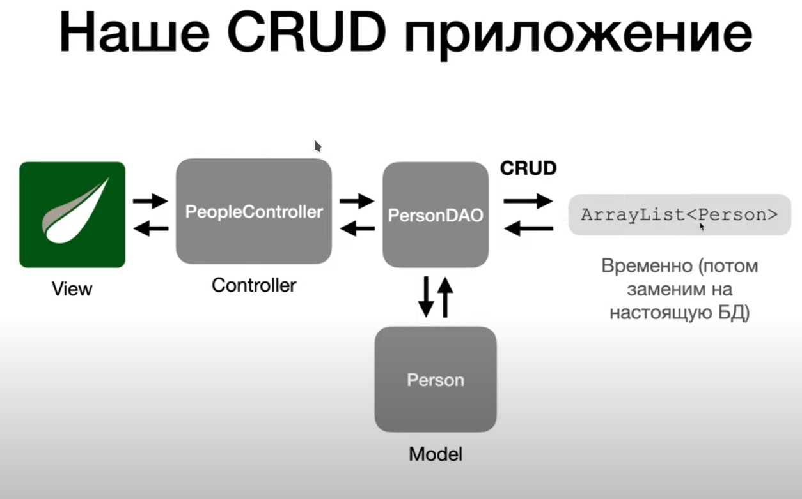

# springcourse.lesson22

<h1>Урок 21</h1>
]
На этом уроке мы создадим приложение, которое будет использовать DAO и записывать информацию в ArrayList вместо базы данных. Данные будут читаться, обновляться и удаляться в arraylist’е.
PersonDAO будет общаться с нашем списком, а PersonController будет будт обращаться к этому DAO и будет либо читать с него данные, либо вызывать с него методы, чтобы создать нового человека, удалить или изменить человека. И все что мы получаем от PersonDAO, это может быть список людей или конкретного человека, мы будет отображать на странице в браузере с помощью шаблонизатора Thymeleaf. И с помощью Thymeleaf мы создадим формы, с потомощью которых мы будем каких-то людей новых создавать, и будем делать POST или PATCH или DELETE запросы к контроллеру. Контроллер будет вызывать какой-то метод DAO, который будет добавлять, удалять человека.

PersonDAO будет общаться с нашем списком, а PersonController будет будт обращаться к этому DAO и будет либо читать с него данные, либо вызывать с него методы, чтобы создать нового человека, удалить или изменить человека. И все что мы получаем от PersonDAO, это может быть список людей или конкретного человека, мы будет отображать на странице в браузере с помощью шаблонизатора Thymeleaf. И с помощью Thymeleaf мы создадим формы, с потомощью которых мы будем каких-то людей новых создавать, и будем делать POST или PATCH или DELETE запросы к контроллеру. Контроллер будет вызывать какой-то метод DAO, который будет добавлять, удалять человека.

<h1>Урок 22</h1>
